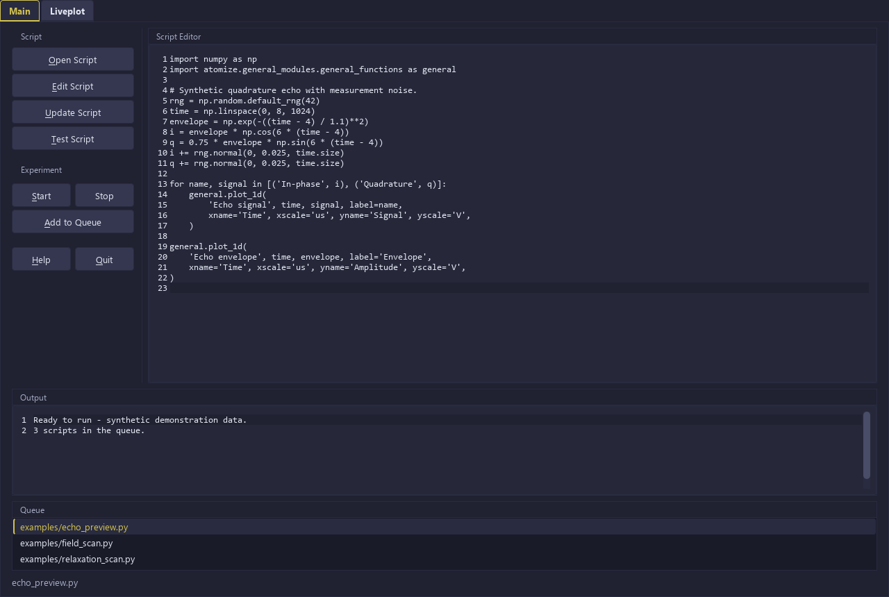
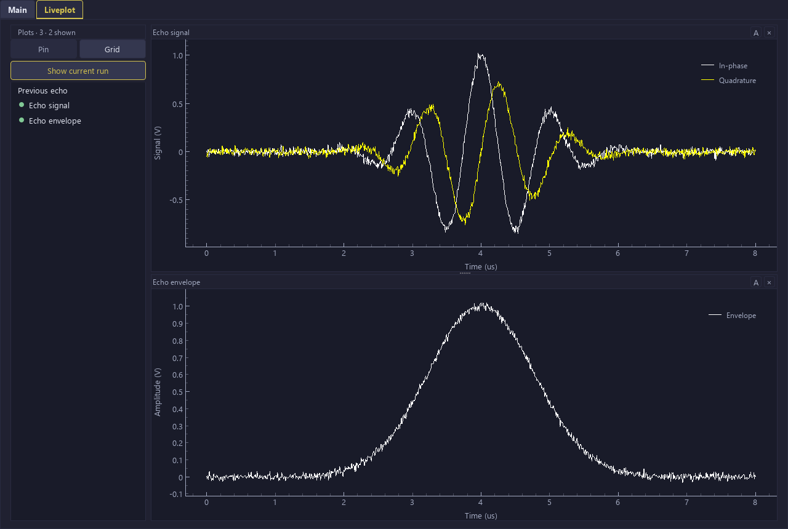
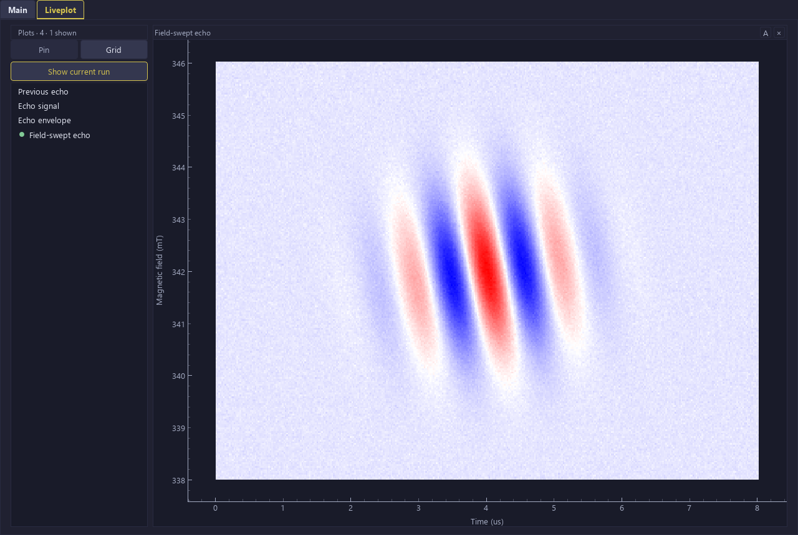

<p align="center">
  
</p>

<h1 align="center">Atomize</h1>

<p align="center">
  <a href="https://pypi.org/project/atomize-py/"></a>
  <a href="https://pypi.org/project/atomize-py/"></a>
  <a href="https://anatoly1010.github.io/atomize_docs/"></a>
  <a href="https://doi.org/10.5334/jors.594"></a>
  <a href="license.md"></a>
</p>

Atomize is a modular software for controlling scientific and industrial instruments, combining them into a unified multifunctional setup, and automating routine experimental work. Experiments are ordinary Python scripts: they import an instrument module, call its functions, and push the data to a live plot.

The idea follows [FSC2](http://users.physik.fu-berlin.de/~jtt/fsc2.phtml) by Jens Thomas Törring. Home-written control programs are usually locked to one experiment and one set of devices. Atomize and FSC2 separate the two: instrument communication lives in modules, and the experiment lives in a script (EDL in FSC2, Python in Atomize).

- **55+ instruments** across 19 categories: oscilloscopes, digitizers, AWGs, pulse programmers, lock-ins, temperature and field controllers, microwave bridges, and more. See the [full list](https://anatoly1010.github.io/atomize_docs/instruments/).
- **Python scripting** with NumPy on hand for raw-data treatment; PyQt is available for scripts that need their own small GUI.
- **Live plotting** built on [liveplot](https://github.com/PhilReinhold/liveplot) by Phil Reinhold, embedded and extended on top of pyqtgraph: 1D and 2D plots, cross-sections, cursors, fitting.
- **Math modules** for fitting, FFT and phase correction, and signal processing.
- **Test mode** runs any script end to end without hardware, validating the arguments on the way.
- **Extendable.** A new instrument is one module plus one config file; see [writing modules](https://anatoly1010.github.io/atomize_docs/writing_modules/).

An extended variant with a GUI control window for a pulsed EPR endstation lives in [Atomize_ITC](https://github.com/Anatoly1010/Atomize_ITC).

## Installation

```bash
pip install atomize-py
atomize
```

Optional extras:

| Extra    | Installs           | Needed for                       |
| -------- | ------------------ | -------------------------------- |
| `serial` | pyserial           | RS-232 instruments               |
| `modbus` | minimalmodbus      | Modbus instruments               |
| `math`   | SciPy              | math modules                     |
| `bots`   | pyTelegramBotAPI   | Telegram notifications           |
| `test`   | pytest             | the test suite                   |

```bash
pip install "atomize-py[serial,modbus,math]"
```

Some instruments also need a vendor driver: [linux-gpib](https://linux-gpib.sourceforge.io/) for GPIB, [SpinAPI](http://www.spincore.com/support/spinapi/) for Pulse Blaster ESR 500 Pro, [Spcm](https://spectrum-instrumentation.com/en/m4i4450-x8) for Spectrum M4I cards. Full details are in the [requirements](https://anatoly1010.github.io/atomize_docs/requirements/).

Atomize needs Python 3.10 or newer. It is used daily on several EPR spectrometers and has been tested on Ubuntu 18.04, 20.04 and 22.04 and on Windows 10.

## Configuration

On start, Atomize prints where its files are:

```
SYSTEM: Linux
DATA DIRECTORY: /path/to/experimental/data/
SCRIPTS DIRECTORY: /path/to/scripts/
MAIN CONFIG PATH: ~/.config/atomize-py/main_config.ini
DEVICE CONFIG DIRECTORY: ~/.config/atomize-py/device_config/
EDITOR: nano
```

Edit `main_config.ini` to set the text editor, the default data and script directories, and the Telegram bot credentials:

```ini
[DEFAULT]
editor = subl                      # Linux
editorW = C:\path\to\editor.exe    # Windows
open_dir = /path/to/experimental/data/
script_dir = /path/to/scripts/
telegram_bot_token =
message_id =
```

Each instrument has its own config file in the device config directory. Pick the protocol (GPIB, RS-232, Ethernet, Modbus) and fill in the address and settings of your device, as described in [protocol settings](https://anatoly1010.github.io/atomize_docs/protocol_settings/).

## Writing an experiment

Import a module, create its class (always named after the module file), and call its functions. Creating the class connects to the instrument.

```python
import numpy as np
import atomize.device_modules.Keysight_3000_Xseries as keys
import atomize.device_modules.Lakeshore_331 as tc
import atomize.general_modules.general_functions as general
import atomize.general_modules.csv_opener_saver as openfile

scope = keys.Keysight_3000_Xseries()
lakeshore = tc.Lakeshore_331()
file_handler = openfile.Saver_Opener()

general.message(scope.oscilloscope_name())
temperature = lakeshore.tc_temperature('A')

y = scope.oscilloscope_get_curve('CH1')
x = np.arange(len(y))
general.plot_1d('Trace', x, y, xname = 'Point', yname = 'Signal', yscale = 'V')
file_handler.save_data('trace.csv', np.c_[x, y], header = f'T = {temperature} K')
```

More examples with dummy data, including a script with its own GUI, are in [`atomize/script_examples/`](atomize/script_examples). The [usage guide](https://anatoly1010.github.io/atomize_docs/usage/) covers the main window, live plotting, test mode, and data files.

## Documentation

- [Documentation site](https://anatoly1010.github.io/atomize_docs/)
- [Available instruments](https://anatoly1010.github.io/atomize_docs/instruments/)
- [Protocol settings](https://anatoly1010.github.io/atomize_docs/protocol_settings/)
- [Writing modules](https://anatoly1010.github.io/atomize_docs/writing_modules/)

## Citing

If you use Atomize, please cite the [JORS paper](https://doi.org/10.5334/jors.594):

> Melnikov A., Vedkal A., Ishchenko A., Veber S. *Atomize: A Modular Software for Control and Automation of Scientific and Industrial Instruments.* Journal of Open Research Software, 13(1), 26 (2025). DOI: [10.5334/jors.594](https://doi.org/10.5334/jors.594)

## Screenshots

Main window with the script editor, output log and queue:



Live 2D plot of a time-resolved EPR experiment (field versus time):



Live 1D plot of a CW EPR spectrum accumulated over scans:



---

<sub>Atomize = A + TOM + ize. A stands for Anatoly, the main developer; TOM for the International TOMography Center, our organization.</sub>
